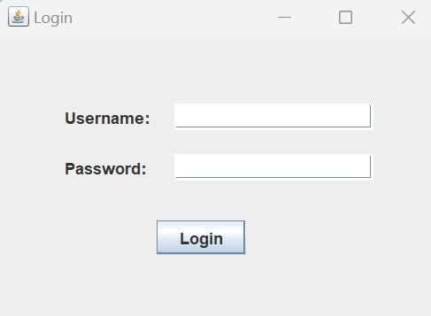
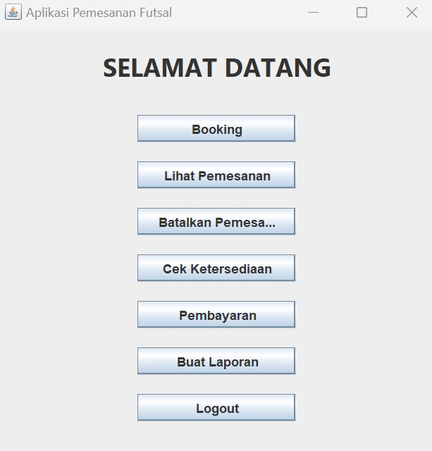
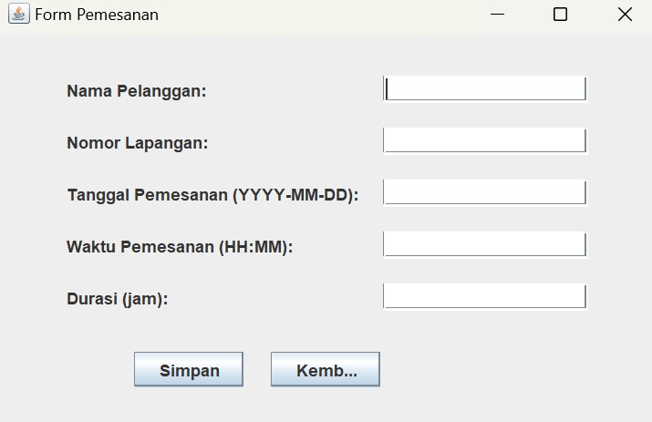
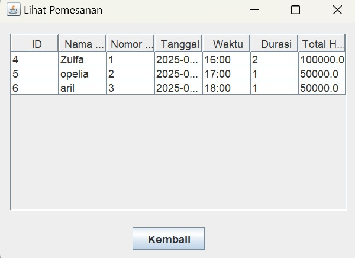
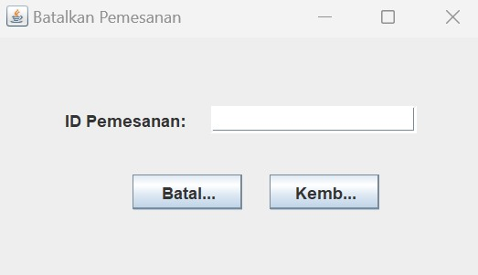
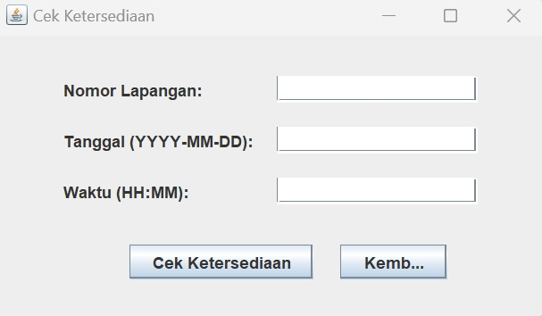
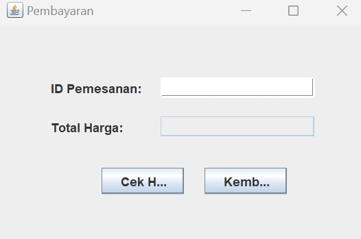
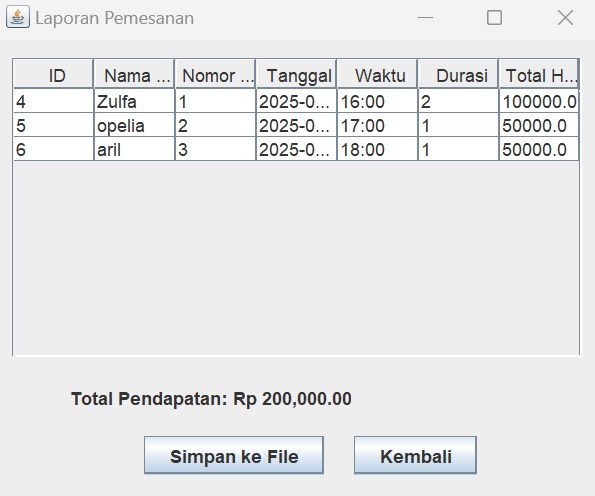
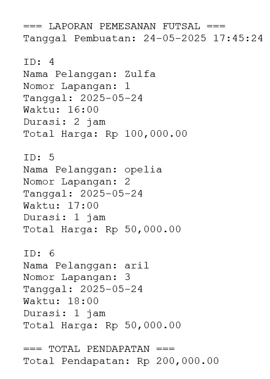

# Aplikasi Pemesanan Futsal

Aplikasi ini digunakan untuk melakukan pemesanan lapangan futsal, cek ketersediaan, pembayaran, dan generate laporan. Dibangun menggunakan Java Swing dan terhubung ke database MySQL.

## Fitur
- Booking
- Lihat Pemesanan
- Batalkan Pemesanan
- Cek Ketersediaan
- Pembayaran
- Buat Laporan
- Logout

## Kontributor
Kontributor dan Tanggung Jawab Fitur
1. Zulfa
- Pemesanan Lapangan (FrmBooking.java)
- Generate Laporan (FrmGenerateReport.java)

2. Opellia77
- Melihat Pemesanan (FrmViewBookings.java)

- Membatalkan Pemesanan (FrmCancelBooking.java)

3. AidanLahith
- Cek Ketersediaan (FrmCheckAvailability.java)
- Pembayaran (FrmPayment.java)

Tools & Teknologi
- Java (JDK 21)
- MySQL Database
- Java Swing
- NetBeans IDE
- MySQL Connector (mysql-connector-j-9.3.0.jar)

## Halaman Login

Gambar ini menunjukkan tampilan halaman login aplikasi FutsalBookingApp, Halaman ini digunakan pengguna untuk masuk ke sistem dengan memasukkan kredensial mereka.

## Menu Utama

Aplikasi ini dirancang untuk mempermudah pengguna dalam melakukan pemesanan lapangan futsal secara online. Dengan tampilan yang sederhana dan fitur yang mudah digunakan, pengguna dapat dengan cepat melakukan booking dan mengecek ketersediaan lapangan.

## Form Pemesanan

Form ini digunakan oleh pengguna untuk melakukan pemesanan lapangan futsal. Pengguna diminta mengisi data yang diperlukan agar pemesanan tercatat dengan baik.

## Lihat Pemesanan
.

Halaman ini menampilkan daftar semua pemesanan lapangan futsal yang telah dilakukan oleh pengguna.

## Batalkan Pemesanan
.

Halaman ini digunakan untuk membatalkan pemesanan lapangan futsal yang sudah dibuat sebelumnya.

## Cek Ketersediaan
.

Halaman ini digunakan untuk mengecek apakah lapangan tersedia pada waktu dan tanggal tertentu sebelum melakukan pemesanan.

## Pembayaran
.

Halaman ini digunakan untuk mengecek dan memproses pembayaran pemesanan lapangan futsal.

## Laporan Pemesanan
.

Halaman ini menampilkan rekap semua data pemesanan lapangan, lengkap dengan total pendapatan yang diperoleh.

## Format Laporan Pemesanan Futsal
.

Laporan ini berisi detail pemesanan yang telah dilakukan pada suatu tanggal, termasuk informasi pelanggan, jadwal, dan total pendapatan.
